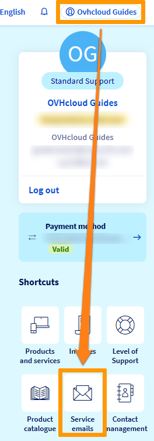
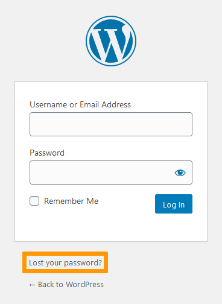

**Dernière mise à jour le 17/09/2021**

## Objectif

Il peut parfois être nécessaire, en cas de hack notamment, de modifier l'ensemble de vos mots de passe. Vous trouverez ici toutes les informations nécessaires.

**Découvrez comment modifier les mots de passe de vos services OVHcloud.**

> [!warning]
>
> OVHcloud met à votre disposition des services dont la configuration, la gestion et la responsabilité vous incombent. Il vous revient de ce fait d'en assurer le bon fonctionnement.
>
> Nous mettons à votre disposition ce guide afin de vous accompagner au mieux sur des tâches courantes. Néanmoins, nous vous recommandons de faire appel à un prestataire spécialisé et/ou de contacter l'éditeur du service si vous éprouvez des difficultés. En effet, nous ne serons pas en mesure de vous fournir une assistance. Plus d'informations dans la section [Aller plus loin](#aller-plus-loin) de ce guide.
>

## Prérequis

- Disposer d’un compte client et de services OVHcloud actifs.
- Connaître l'identifiant et le mot de passe de votre [espace client OVHcloud](https://www.ovh.com/auth/?action=gotomanager&from=https://www.ovh.com/fr/&ovhSubsidiary=fr) ou avoir accès à l'adresse e-mail de récupération de votre compte.

> [!primary]
>
> Pour modifier les mots de passe de vos différents services OVHcloud, seuls les identifiants d'accès à votre [espace client](https://www.ovh.com/auth/?action=gotomanager&from=https://www.ovh.com/fr/&ovhSubsidiary=fr) sont nécessaires.
>
> Une fois connecté à votre [compte OVHcloud](https://www.ovh.com/auth/?action=gotomanager&from=https://www.ovh.com/fr/&ovhSubsidiary=fr), vous pourrez modifier les mots de passe de l'ensemble de vos services sans fournir les mots de passe actuels.
>

## En pratique

### Bonnes pratiques

Afin de sécuriser vos services OVHcloud et les données qu'ils contiennent, nous vous recommandons d'adopter les pratiques suivantes : 

#### Utiliser des mots de passe complexes

Assurez-vous que vos mots de passe OVHcloud respectent les exigences de complexité suivantes : 

- comporter au minimum 12 caractères ;

- comporter au moins 1 lettre majuscule, 1 lettre minuscule et 1 chiffre ;

- ne pas être tirés du dictionnaire ;

- ne pas comporter d'informations personnelles (votre prénom, nom ou date de naissance) ;

- être stockés dans un [coffre-fort de mots de passe](https://keepass.info/){.external} ;

- être changés au minimum tous les 3 mois ;

- être différents de ceux utilisés auparavant.

Il existe plusieurs méthodes efficaces pour créer des mots de passe. Parmi elles, nous vous conseillons la **méthode des premières lettres** et la **méthode phonétique** qui sont détaillées sur [cybermalveillance.gouv.fr](https://www.cybermalveillance.gouv.fr/tous-nos-contenus/bonnes-pratiques/mots-de-passe){.external}, le site gouvernemental d'assistance et de prévention du risque numérique.

La [Commission Nationale de l'Informatique et des Libertés](https://www.cnil.fr/){.external} (CNIL) propose également un [outil permettant de générer un mot de passe solide](https://www.cnil.fr/fr/generer-un-mot-de-passe-solide){.external}, basé sur la méthode des premières lettres.

Pour en savoir plus, reportez-vous à la section [Aller plus loin](#aller-plus-loin) en bas de ce guide.

#### Utiliser un gestionnaire de mots de passe

Des logiciels spécifiques permettent de sauvegarder et sécuriser vos mots de passe.

Vous pouvez, par exemple, utiliser le gestionnaire de mots de passe [Keepass](https://keepass.info/){.external}. Il s’agit d’un logiciel libre et gratuit recommandé par l'[Agence nationale de sécurité des systèmes d'information](https://www.ssi.gouv.fr/){.external} (ANSSI).

Son principe est simple : un mot de passe maître – qui doit être suffisamment complexe, mais que vous devez mémoriser – permet d'accéder à une base de données regroupant tous vos identifiants et mots de passe. Ces derniers peuvent être très complexes, car le logiciel pourra les retenir.

Ce logiciel permet également de générer des mots de passe complexes aléatoires qu'il sauvegardera pour chacun de vos sites ou applications.

#### Autres bonnes pratiques pour la gestion de vos mots de passe

- **Vérifiez la fiabilité de vos mots de passe.** Assurez-vous que votre mot de passe actuel n'a pas été transmis à des personnes malveillantes. Vous pouvez effectuer un test sur le site [haveibeenpwned.com](https://haveibeenpwned.com/){.external} prévu à cet effet pour vérifier qu'il n'a pas été compromis à la suite de violations de données.
Si l'un de vos mots de passe est compromis, nous vous recommandons de le modifier immédiatement.

- **Utilisez un mot de passe différent pour chaque service.** Le mot de passe d'accès à votre [compte OVHcloud](https://www.ovh.com/auth/?action=gotomanager&from=https://www.ovh.com/fr/&ovhSubsidiary=fr) ne doit pas être réutilisé sur d'autres sites ou d'autres applications. Nous vous recommandons d'ailleurs d'appliquer cette règle à l'ensemble de vos services web. Un mot de passe différent pour chaque site permet d'éviter toute vulnérabilité en cas de vol d'un seul mot de passe.

- **N'enregistrez jamais vos mots de passe dans votre navigateur.** Malgré son aspect pratique, il n'est pas recommandé d'autoriser l’enregistrement du mot de passe par votre navigateur via la case à cocher « Retenir le mot de passe ».  Cette manipulation pose plusieurs problèmes de sécurité, notamment lorsqu’une personne mal intentionnée prend le contrôle de votre ordinateur. Il lui suffit alors de récupérer le fichier contenant la liste des mots de passe enregistrés pour pouvoir se connecter à vos différents comptes.

- **Changez régulièrement vos mots de passe.** Modifier régulièrement votre mot de passe permet d'augmenter la sécurité de votre compte. Si vous avez le moindre soupçon, changez-le immédiatement. La prise en compte du nouveau mot de passe entraîne automatiquement la fermeture de toutes les sessions actives sur votre [compte OVHcloud](https://www.ovh.com/auth/?action=gotomanager&from=https://www.ovh.com/fr/&ovhSubsidiary=fr). Surtout, celui-ci doit différer des précédents mots de passe utilisés.

- **Gardez vos mots de passe secrets.** Un mot de passe doit rester caché. Il ne doit donc être ni écrit, ni partagé entre plusieurs utilisateurs, ni communiqué à un tiers. Les équipes OVHcloud ne vous demanderont jamais votre mot de passe, notamment par e-mail.

### Modifier vos mots de passe OVHcloud

#### Espace client OVHcloud

Pour modifier le mot de passe de votre [espace client OVHcloud](https://www.ovh.com/auth/?action=gotomanager&from=https://www.ovh.com/fr/&ovhSubsidiary=fr), suivez les instructions de ce [guide](https://docs.ovh.com/fr/customer/gerer-son-mot-de-passe/#modifier-votre-mot-de-passe).

> [!primary]
>
> Sécuriser l'accès à votre [espace client](https://www.ovh.com/auth/?action=gotomanager&from=https://www.ovh.com/fr/&ovhSubsidiary=fr) est primordial, car une divulgation de ses identifiants à une personne malveillante implique que l'ensemble de vos services OVHcloud peuvent être compromis.
>
> En plus de respecter les bonnes pratiques ci-dessus, nous vous recommandons donc aussi :
>
> - d'activer la [double authentification](https://docs.ovh.com/fr/customer/securiser-son-compte-avec-une-2FA/) sur votre compte ;
>
> - d'ajouter une [adresse e-mail de secours](https://docs.ovh.com/fr/customer/tout-savoir-sur-identifiant-client/#ajouter-une-adresse-e-mail-de-secours) sur votre compte ;
>
> - de vous assurer que vos [données personnelles](https://docs.ovh.com/fr/customer/tout-savoir-sur-identifiant-client/#modifier-mes-informations-personnelles) sont à jour sur votre compte client.
>

#### Accès à l'espace de stockage de fichiers

##### Accès en FTP

Pour modifier le mot de passe d'accès FTP à l'[espace de stockage de votre hébergement](../connexion-espace-stockage-ftp-hebergement-web/), suivez les instructions de ce [guide](../modifier-mot-de-passe-utilisateur-ftp/).

> [!success]
>
> Si vous souhaitez retrouver le mot de passe FTP actuel, consultez les e-mails émanant de nos services. Lors de l'installation de votre [offre d'hébergement](https://www.ovh.com/fr/hebergement-web/), un message contenant l'identifiant FTP (login) et le mot de passe associé vous a en effet été envoyé.
>
> Vous pouvez retrouver cet e-mail à tout moment en haut à droite de votre [espace client OVHcloud](https://www.ovh.com/auth/?action=gotomanager&from=https://www.ovh.com/fr/&ovhSubsidiary=fr) sur votre nom puis sur `E-mails de service`{.action}.
>
>{.thumbnail}
>
> Si vous avez par contre modifié le mot de passe indiqué dans ce message, vous devrez le modifier en suivant ces [instructions](../modifier-mot-de-passe-utilisateur-ftp/).
>

##### Accès en SSH

La connexion se fait avec les mêmes identifiants et mots de passe que pour la [connexion FTP](../connexion-espace-stockage-ftp-hebergement-web/). Pour modifier votre mot de passe SSH, suivez donc également les instructions de ce [guide](../modifier-mot-de-passe-utilisateur-ftp/).

> [!primary]
>
> [Se connecter en SSH](../mutualise-le-ssh-sur-les-hebergements-mutualises/) à votre serveur d'hébergement nécessite de posséder une offre [Pro](https://www.ovh.com/fr/hebergement-web/hebergement-pro.xml) ou [Performance](https://www.ovh.com/fr/hebergement-web/hebergement-performance.xml).
>

#### Base de données

> [!alert]
>
> En modifiant le mot de passe de votre base de données, vous devrez également répercuter ce changement dans le fichier de configuration liant cette dernière à votre site Internet.
>
> Pour toute question à ce sujet, consultez ce [guide](../modifier-mot-de-passe-base-de-donnees/).
>

##### Offre StartSQL

Pour modifier le mot de passe de votre [base de données StartSQL](https://www.ovh.com/fr/hebergement-web/options-sql.xml), suivez les instructions de ce [guide](../modifier-mot-de-passe-base-de-donnees/).

> [!primary]
>
> Les <i>bases de données StartSQL</i> sont celles qui apparaissent dans l'onglet `Bases de données`{.action} de la partie `Hébergements`{.action} de votre [espace client](https://www.ovh.com/auth/?action=gotomanager&from=https://www.ovh.com/fr/&ovhSubsidiary=fr).
>
> L'ensemble de nos [offres d'hébergement mutulisées](https://www.ovh.com/fr/hebergement-web/), à l'exception des offres gratuites [Start10M](../activer-start10m/)) comportent ce type de bases de données.
>

##### Serveur SQL privé

Pour modifier le mot de passe d'une base de données sur votre [serveur SQL privé](../premiers-pas-avec-sql-prive/), rendez vous dans l'onglet `Bases de données`{.action} situé sur la gauche de votre écran et choisissez le serveur concerné. 
Cliquez ensuite sur l'onglet `Utilisateurs et droits`{.action} puis sur le bouton `...`{.action} et `Changer le mot de passe`{.action}.

> [!success]
>
> Si vous souhaitez retrouver le mot de passe de votre base de données et non le modifier, connectez-vous à [l'espace de stockage de votre hébergement](../connexion-espace-stockage-ftp-hebergement-web/). Le mot de passe actuel de votre base de donnée sera mentionné dans le fichier de configuration de votre site (Par exemple, pour WordPress, il s'agira du fichier « wp-config.php ») situé à la racine du dossier d'installation de votre site.
>

#### Adresse E-mail OVHcloud

Pour modifier le mot de passe de votre [adresse e-mail MX Plan](../../emails/), suivez les instructions de ce [guide](../../emails/modifier-mot-de-passe-adresse-email/).

> [!primary]
>
> Après avoir modifié le mot de passe de votre adresse e-mail depuis votre [espace client](https://www.ovh.com/auth/?action=gotomanager&from=https://www.ovh.com/fr/&ovhSubsidiary=fr), vous devrez indiquer le nouveau mot de passe sur l'ensemble des appareils où elle a été configurée.
>

#### Interface administrateur de votre site

La méthode pour changer le mot de passe de l'interface administrateur de votre site dépend de son mode d'installation.

##### Cas n°1 : installation avec un Module en 1 clic 

Si vous avez créé votre site avec la fonctionnalité [Module en 1 clic](../modules-en-1-clic/), modifiez son mot de passe administrateur via votre [espace client OVHcloud](https://www.ovh.com/auth/?action=gotomanager&from=https://www.ovh.com/fr/&ovhSubsidiary=fr) :

- Dans la partie `Web cloud`{.action}, cliquez sur `Hébergements`{.action} puis sur l'hébergement concerné ;
- Cliquez sur l'onglet `Modules en 1 clic`{.action} puis sur le bouton `...`{.action} concerné et sur `Modifier le mot de passe`{.action}.

Un e-mail contenant le nouveau mot de passe vous sera ensuite envoyé.

Vous pouvez également utiliser le lien `Mot de passe oublié` présent sur la page de connexion à l'interface administrateur de votre site :

{.thumbnail}

##### Cas n°2 : installation manuelle d'un CMS

Si vous avez créé votre site en [installant manuellement un logiciel de gestion de contenu (CMS)](../mutualise-installer-manuellement-mon-cms/) (comme Wordpress par exemple), utilisez également le lien `Mot de passe oublié` présent sur la page de connexion à l'interface administrateur de votre site.

Si ce dernier ne fonctionne pas ou que vous souhaitez retrouver votre mot de passe administrateur actuel sans le modifier, contactez la [communauté d'utilisateurs](https://community.ovh.com) ou les [partenaires OVHcloud](https://partner.ovhcloud.com/fr/). Nous ne serons pas en mesure de vous apporter une assistance sur ce sujet. 

##### Cas n°4 : installation sans CMS

Si votre site a été créé à partir d'un langage de programmation (PHP, HTML, etc.) ou d'un framework (Symfony, Laravel, etc.) et que vous ne parvenez pas à modifier ou à retrouver son mot de passe administrateur, contactez la [communauté d'utilisateurs](https://community.ovh.com) ou les
[partenaires OVHcloud](https://partner.ovhcloud.com/fr/). Nous ne serons pas en mesure de vous apporter une assistance sur ce sujet.

## Aller plus loin 

[Sécuriser son compte OVHcloud avec la double authentification](https://docs.ovh.com/fr/customer/securiser-son-compte-avec-une-2FA/)

[Sécuriser mon compte OVHcloud et gérer mes informations personnelles](https://docs.ovh.com/fr/customer/tout-savoir-sur-identifiant-client/)

[Modifier le mot de passe de votre compte](https://docs.ovh.com/fr/customer/gerer-son-mot-de-passe/)

[Les recommandations de sécurité relatives aux mots de passe de l'ANSSI](https://www.ssi.gouv.fr/uploads/IMG/pdf/NP_MDP_NoteTech.pdf){.external}

[Les mesures de sécurité élémentaires relatives aux mots de passe définies par la CNIL](https://www.cnil.fr/fr/authentification-par-mot-de-passe-les-mesures-de-securite-elementaires){.external}

[Les conseils de cybermalveillance.gouv.fr](https://www.cybermalveillance.gouv.fr/tous-nos-contenus/){.external}

Pour des prestations spécialisées (référencement, développement, etc), contactez les [partenaires OVHcloud](https://partner.ovhcloud.com/fr/).

Échangez avec notre communauté d'utilisateurs sur <https://community.ovh.com/>.

